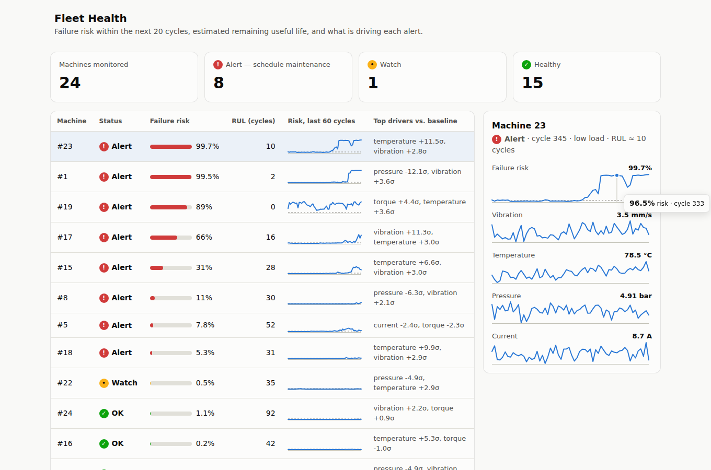
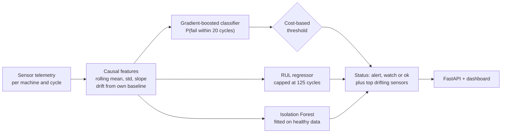

# Predictive Maintenance ML

**Predict machine failures before they happen — and decide when an alert is worth acting on.**

[](https://github.com/Krishna-44/predictive-maintenance-ml/actions/workflows/ci.yml)


[](LICENSE)

<picture>
  <source media="(prefers-color-scheme: dark)" srcset="docs/dashboard-dark.png">
  
</picture>

An end-to-end predictive-maintenance system for a fleet of industrial machines: it turns raw sensor
telemetry into **failure-risk alerts**, **remaining-useful-life (RUL) estimates** and **anomaly
scores**, explains each alert in plain terms ("vibration +11σ above this machine's baseline"), and
serves it all through a REST API and a fleet dashboard.

The focus is on the parts that decide whether a model like this works in a real plant: leakage-free
evaluation, causal features, an alert threshold chosen from maintenance costs, and metrics an
operations team cares about (how many cycles of warning, how many false alarms).

## Results

Held-out evaluation on **40 machines the model never saw** (120 used for training; 37,215 cycles
in total). Predicting *failure within the next 20 cycles*; 9.0% of cycles are positive.

| | Value |
|---|---|
| ROC-AUC / PR-AUC | **0.978 / 0.898** |
| Failures flagged at least 10 cycles in advance | **97.5%** (39 of 40) |
| Median warning time | **36 cycles** |
| False alarms on healthy cycles | **0.65%** |
| RUL error (MAE), all cycles / final 30 cycles | 12.0 / 10.6 cycles |
| Anomaly detector ROC-AUC (trained on healthy data only) | 0.871 |

Reproduce with `predmaint train` — every number above is written to
[`reports/metrics.json`](reports/metrics.json).

**What the numbers say, and what they don't:**

- **The alert threshold is a business decision**, so it's chosen to minimise expected cost (a missed
  failure is assumed to cost 10× an unnecessary inspection), using out-of-fold predictions on the
  training machines only. The trade-off at other cost ratios:

  | Miss : false-alarm cost | Recall | Precision | Flagged ≥10 cycles early | Median warning | False alarms (healthy) |
  |---:|---:|---:|---:|---:|---:|
  | 2 : 1 | 0.902 | 0.686 | 95.0% | 29 cycles | 0.11% |
  | 5 : 1 | 0.933 | 0.614 | 97.5% | 31 cycles | 0.20% |
  | **10 : 1** | **0.943** | **0.554** | **97.5%** | **36 cycles** | **0.65%** |
  | 20 : 1 | 0.954 | 0.472 | 97.5% | 41 cycles | 1.81% |
  | 50 : 1 | 0.979 | 0.288 | 97.5% | 60 cycles | 11.32% |

- **Gradient boosting beats the baseline, but not by much.** Logistic regression on the same
  features reaches PR-AUC 0.887 vs. 0.898. Most of the lift comes from the features (deviation
  from each machine's own baseline), not the model — which is the useful finding.
- **The hard case is abrupt failures.** Electrical faults develop over a short window late in life;
  the model caught 2 of the 3 in the test set (every bearing, overheating and seal failure was
  caught). Three machines is too few to quote a rate — it's flagged as the top risk in the
  [model card](docs/MODEL_CARD.md).
- **The model ignores the decoys.** The simulator includes two sensors with no relation to failure
  (`humidity`, `voltage`); their permutation importance is ≈0 (max 0.0006, vs. 0.24 for the top
  feature, `pressure_delta`).

## Why a machine-level split matters

A random row split puts neighbouring cycles of the same machine in both train and test, so the model
can recognise *machines* instead of learning *degradation*. Measured on this data:

| Split | PR-AUC |
|---|---:|
| Random rows (leaky) | 0.986 |
| By machine (honest) | **0.898** |

The leaky number looks better and is wrong. Every metric in this project uses the machine split,
and threshold tuning uses grouped cross-validation inside the training machines.

## How it works



- **Data** (`simulate.py`): 160 machines run to failure under three load levels with four failure
  modes — bearing wear, overheating, seal leak and (rarer, abrupt) electrical faults. It includes
  what makes real telemetry hard: a per-cycle operating setting that moves several sensors on its
  own, machine-to-machine baseline differences, noise, vibration glitches, sensor dropouts and two
  irrelevant sensors. The data is synthetic so the project is reproducible end to end; the
  modelling code only depends on the column layout.
- **Features** (`features.py`): rolling mean, standard deviation and slope over the last 10 cycles,
  plus each sensor's drift from that machine's own commissioning baseline. Every feature is
  **causal** — a test truncates histories and checks that no feature changes, i.e. nothing leaks
  from the future.
- **Models** (`train.py`): `HistGradientBoostingClassifier` for failure risk, a gradient-boosted
  regressor for RUL, and an `IsolationForest` trained only on clearly healthy periods (useful for
  failure modes the classifier has never seen).
- **Decisions** (`service.py`): *alert* when risk crosses the cost-based threshold; *watch* when
  any model sees early signs (risk above a third of the threshold, an anomaly score above 3σ, or
  estimated RUL under 40 cycles). Each assessment lists the sensors that drifted most from baseline.

## Quick start

```bash
git clone https://github.com/Krishna-44/predictive-maintenance-ml.git
cd predictive-maintenance-ml
python -m venv .venv && source .venv/bin/activate
pip install -e ".[dev]"

predmaint train          # ~20 s: simulate, train, evaluate, save model + reports/metrics.json
predmaint serve          # dashboard on http://127.0.0.1:8000, API docs on /docs
```

```text
$ predmaint train
160 machines (120 train / 40 test), 37,215 cycles, failure horizon 20 cycles
alert threshold 0.042 (missed failure : false alarm cost = 10 : 1)

  ROC-AUC 0.978   PR-AUC 0.898   precision 0.553   recall 0.943
  failures flagged ≥10 cycles early: 97.5%   median warning: 36 cycles   false alarms on healthy cycles: 0.65%
  RUL MAE 12.0 cycles (final 30 cycles: 10.6)   anomaly ROC-AUC 0.871
  leakage check: PR-AUC 0.986 with a random row split vs 0.898 with a machine split
```

Other commands: `predmaint simulate --out fleet.csv` writes a dataset; `predmaint train --data
your.csv --miss-cost 20` trains on your own run-to-failure data with a different cost ratio;
`predmaint predict --data latest.csv` assesses the latest cycle of every machine in a file.

**Docker** (trains during the build, so the container starts with a ready model):

```bash
docker build -t predictive-maintenance .
docker run -p 8000:8000 predictive-maintenance
```

## API

| Method | Path | Description |
|---|---|---|
| `POST` | `/api/predict` | A machine's readings since commissioning → risk, status, RUL, anomaly score, drivers |
| `GET` | `/api/fleet` | Assessment of every machine in the demo fleet, most urgent first |
| `GET` | `/api/metrics` | Evaluation metrics of the loaded model |
| `GET` | `/api/health` | Status, alert threshold, horizon |

```bash
curl -s localhost:8000/api/predict -H 'content-type: application/json' -d '{
  "machine_id": 7,
  "readings": [
    {"cycle": 1, "load": "medium", "duty": 1.0, "temperature": 72.1, "vibration": 3.2, "pressure": 5.0,
     "rpm": 1410, "torque": 32.5, "current": 10.1, "humidity": 44, "voltage": 401}
  ]
}'
```

Missing sensor values can be sent as `null`; they're forward-filled per machine, as during training.

## Project structure

```text
src/predmaint/
├── simulate.py      run-to-failure fleet simulator (4 failure modes, dropouts, glitches, decoys)
├── features.py      causal rolling + baseline-drift features, per-sensor drift in σ
├── train.py         classifier, RUL regressor, anomaly model, cost-based threshold, evaluation
├── service.py       alert / watch / ok decisions, explanations, model persistence
├── api.py           FastAPI app
├── cli.py           `predmaint` command
└── static/          fleet dashboard (vanilla JS + SVG, light & dark)
tests/               32 tests: simulator, feature causality, training, decisions, API
reports/metrics.json latest evaluation
docs/MODEL_CARD.md   intended use, data, metrics, limitations
```

## Testing

```bash
pytest -q        # 32 tests, ~12 s
ruff check .
```

Highlights: features are tested for **causality** (truncating the future must not change the past)
and for independence between machines; the simulator is tested for determinism and for each failure
mode showing up in the right sensor; the decision rules and API (including missing values and
validation errors) are covered. CI runs the suite on Python 3.10–3.12 and a full training run that
uploads `metrics.json` as an artifact.

## Limitations and next steps

- Trained and evaluated on simulated data. Validating on a public run-to-failure dataset (e.g.
  NASA C-MAPSS) is the obvious next step; the pipeline only needs the same column layout.
- Electrical faults (short precursor) are under-represented and the weakest failure mode.
- Probabilities are not explicitly calibrated; calibration would make the "watch" band more
  meaningful.
- Planned: per-alert SHAP explanations, a drift monitor that compares live feature distributions to
  training, and scheduled retraining.

## License

[MIT](LICENSE) © Krishna Gupta
